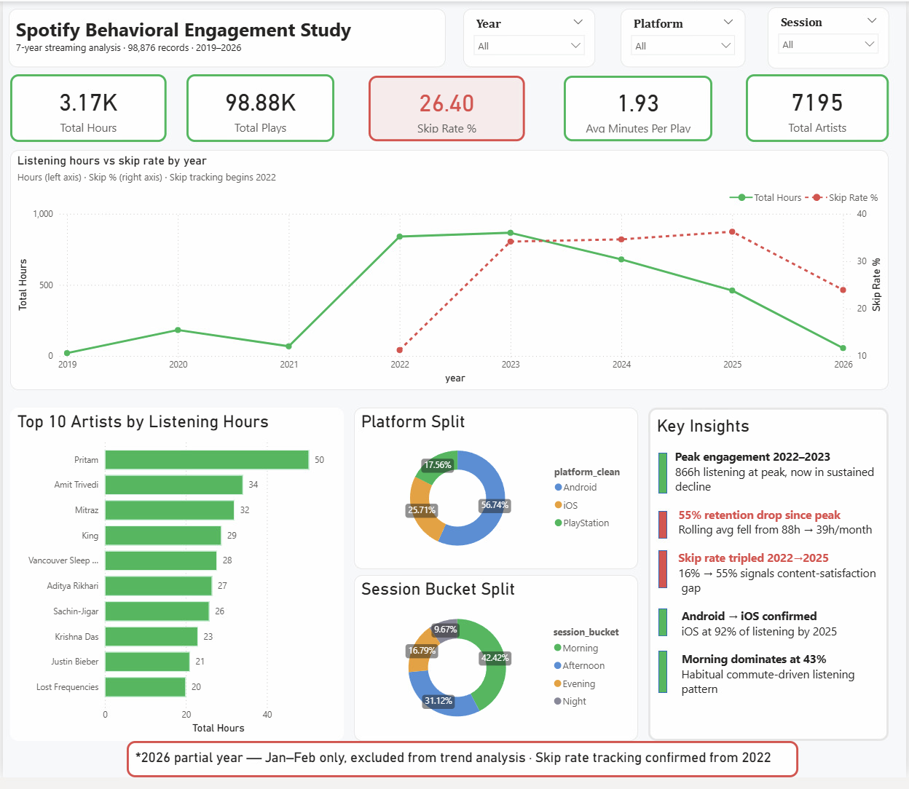

# Spotify Behavioral Engagement Study — Analysis Brief
**Author:** Malak Mehta  
**Dataset:** 98,876 streaming records · 2019–2026 · Individual user listening history  
**Tools:** Python (pandas) · PostgreSQL · Power BI  

---

## Project Overview

This project analyzes 7 years of individual Spotify streaming data to identify behavioral engagement patterns, retention risks, and listening drop-off signals. The dataset was processed end-to-end — from raw JSON ingestion and ETL cleaning in Python, to 15 structured SQL queries across four analytical levels, to an interactive single-page Power BI dashboard.

---

## Business Objective

**Core question:** What drives long-term listener engagement — and what signals predict retention risk or listening drop-off?

**Why this matters:** Streaming platforms live and die by engagement metrics. A user who listens less, skips more, and switches platforms is a churn risk. Identifying the behavioral patterns behind that risk — before the user churns — is the core job of a product or marketing analyst at any streaming company.

---

## Key Findings Summary

| Finding | Metric | Signal |
|--------|--------|--------|
| Peak engagement | 2022–2023 (866h/year) | Baseline established |
| Retention drop | 55% decline in rolling avg since peak | 🔴 High risk |
| Skip rate growth | 16% (2022) → 55% (2025) | 🔴 High risk |
| Avg listen time drop | 2.26 min/play (2020) → 1.78 min/play (2023) | 🔴 Declining quality |
| Morning dominance | 43% of all listening 5am–12pm | 🟢 Habit signal |
| Platform migration | Android → iOS confirmed 2023–2024 | 🟡 Behavioral shift |
| Content diversity | 7,195 unique artists, no artist >1.6% | 🟢 Discovery behavior |

---

## The 5 Whys — Root Cause Analysis

The 5 Whys is a root cause framework used in business analytics to drill below surface-level symptoms to find the underlying driver. Here it is applied to the core problem: **declining listener engagement since 2023.**

---

### Problem Statement
Listening hours dropped by 55% between peak (2023) and 2025, while skip rate tripled in the same period.

---

### Why #1 — Why is total listening time declining?
**Because the user is ending sessions earlier and skipping more songs.**

Evidence: Average minutes per play dropped from 2.26 in 2020 to 1.78 in 2023 — the lowest point in the dataset. This means he isn't just listening less overall, he's also not completing songs when he does listen.

---

### Why #2 — Why is he skipping more songs?
**Because the content being served does not match his taste at the song level — even when the artist is familiar.**

Evidence: Skip rate by artist analysis showed that high-skip artists (Mika Singh 88%, Sonu Nigam 81%, Diljit Dosanjh 69%) do not overlap with top engagement artists (Pritam, Amit Trivedi, Mitraz). This means Spotify's recommendation engine is surfacing songs from artists the user knows but doesn't consistently enjoy — pushing catalog depth rather than personal favorites.

Additionally, Pritam — the top artist by total hours — has a 50% skip rate. This confirms the pattern: familiarity with an artist does not guarantee satisfaction with every song served.

---

### Why #3 — Why is the recommendation engine surfacing mismatched content?
**Because the algorithm is optimizing for artist-level affinity rather than track-level satisfaction.**

This is a known limitation of collaborative filtering models. When a user plays many Pritam songs, the algorithm infers high artist affinity and serves more Pritam — including songs the user has never chosen to play. The skip signal tells us the model is over-indexing on artist-level data and under-weighting the user's demonstrated track-level preferences.

From a product analytics perspective, this is a recommendation quality problem — not a content availability problem.

---

### Why #4 — Why did this problem become visible from 2022 onward?
**Two reasons: skip tracking began in 2022 (data quality), and listening behavior genuinely shifted in 2022.**

Data quality note: Skip rate for 2019–2021 shows as 0% — confirmed to be a data collection gap, not actual behavior. Spotify introduced extended streaming history with detailed skip tracking in later exports.

Behavioral shift: 2022 was also when listening volume exploded by 1,125% YoY — the user started listening significantly more, likely due to a new commute, job, or daily routine. Higher volume naturally exposes more algorithmic recommendations, which increases the chance of mismatched content being surfaced.

---

### Why #5 — Why hasn't engagement recovered despite the skip signal being present since 2022?
**Because the feedback loop between skip behavior and recommendation adjustment is too slow — or the user's taste has evolved faster than the model can adapt.**

Evidence: Skip rate continued rising from 16% (2022) to 55% (2025) despite 3 years of skip data being available. If the algorithm were adapting effectively to skip signals, we would expect skip rate to stabilize or improve over time. Instead it worsened — suggesting either model lag, cold-start behavior after the platform migration (Android to iOS in 2024), or a genuine shift in the user's musical preferences that the algorithm hasn't caught up to.

---

## KPI Analysis — What Worked Best

### Most valuable KPI: Skip Rate % by Year
This single metric told the most complete story. It confirmed the retention risk, identified the 2022 inflection point, and drove the root cause analysis. For a streaming platform, skip rate is arguably the most actionable engagement metric because it's a direct behavioral signal — unlike passive metrics like session length which could be affected by background listening.

### Second most valuable: Rolling 3-month average listening hours
This smoothed out seasonal noise (festival dips, summer drops) and showed the underlying trend clearly — a sustained 55% decline that individual monthly data would have obscured with volatility.

### Supporting KPIs that added context:
- **Avg minutes per play** — confirmed declining engagement quality, not just volume
- **Platform split by year** — revealed the Android → iOS migration which could explain a cold-start recommendation reset
- **Session bucket split** — confirmed habitual morning listening, which is the highest-retention behavioral pattern for streaming platforms

---

## Recommendations for Spotify

### 1. Improve track-level recommendation signals
Move beyond artist-level affinity modeling. The data shows the user loves certain artists but skips half their catalog. A track-level satisfaction score — weighted by completion rate, repeat plays, and explicit skips — would surface the right songs rather than just the right artists.

**Metric to track:** Skip rate per recommendation source (algorithmic vs editorial vs user-initiated)

---

### 2. Prioritize Morning session content quality
43% of all engagement happens between 5am and 12pm. This is a habitual listening window — likely tied to a commute or morning routine. These sessions have the highest retention value because they're behavioral habits, not casual listening.

**Recommendation:** Surface the user's highest-completion tracks during morning sessions rather than discovery content. Reserve new artist recommendations for afternoon/evening sessions when the user is in a more exploratory mindset.

**Metric to track:** Session completion rate by time of day

---

### 3. Investigate post-platform-migration recommendation quality
The Android → iOS migration in 2024 may have triggered a cold-start problem — where the algorithm treated the user as a new listener and reset preference signals. This could explain why skip rate continued rising even after 3 years of available data.

**Recommendation:** Implement cross-device preference continuity — ensure that when a user migrates platforms, their historical skip and completion data carries over to the new device's recommendation model.

**Metric to track:** Skip rate trend in the 6 months post-platform-migration vs baseline

---

### 4. Address seasonal engagement dips proactively
Monthly analysis showed consistent listening drops in October/November (festival season in India) and May/June (summer/exam period). These are predictable behavioral patterns.

**Recommendation:** During low-engagement periods, surface curated playlists tied to the seasonal context (festival music, study playlists) rather than algorithmic recommendations. Proactive content serving during dip periods can reduce churn risk.

**Metric to track:** Monthly active listening hours during historically low periods vs intervention periods

---

### 5. Use high-skip artists as a negative signal, not a neutral one
Artists like Mika Singh (88% skip rate) and Sonu Nigam (81% skip rate) with 50+ plays are strong negative preference signals. The algorithm should use these to filter out similar content, not just to note artist-level disengagement.

**Recommendation:** Build a "content avoidance profile" alongside the preference profile. If a user consistently skips a genre, artist, or tempo range, suppress that content category in recommendations.

**Metric to track:** Skip rate after negative signal suppression vs control group

---

## Data Notes & Limitations

- Skip rate data is only reliable from 2022 onwards. 2019–2021 values of 0% reflect a data collection gap, not actual behavior.
- 2026 data covers January–February only and is excluded from trend analysis.
- This dataset represents a single user — findings are behavioral insights, not statistically generalizable conclusions. In a real product context, this analysis would be applied to a cohort of thousands of users.
- Platform names were standardized using CASE/LIKE logic in both SQL and Power BI DAX due to inconsistent raw strings in early years (e.g. "Android OS 11 API 30 (Xiaomi, POCO X2)" normalized to "Android").

---

*GitHub: [spotify-behavioral-engagement-study](https://github.com/malak-mehta50/spotify-behavioral-engagement-study)*  
Dashboard Preview:

🔗 View Full Dashboard on PowerBI Desktop: [https://app.powerbi.com/groups/me/reports/28cc45c9-82ee-4377-9c23-2a61deb1a74c/90039d0771810c955986?experience=power-bi](url)
